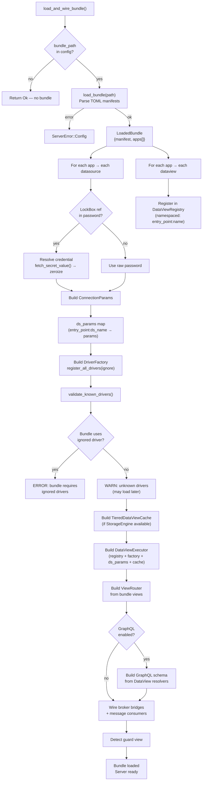
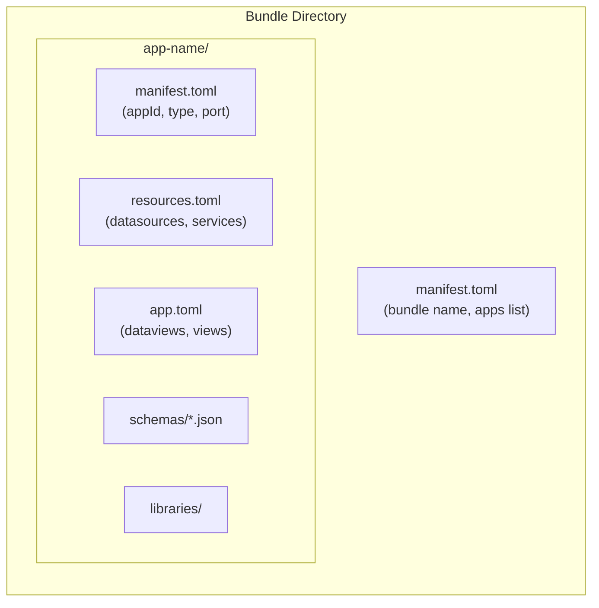
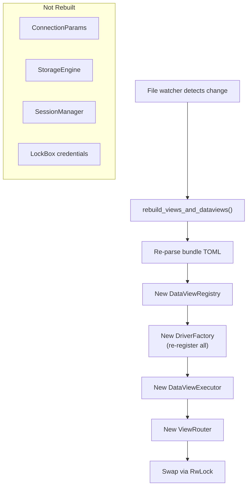

# Bundle Loader

## Load and Wire Flow

```mermaid
flowchart TD
    START["load_and_wire_bundle()"] --> PATH{bundle_path\nin config?}
    PATH -->|no| NOOP["Return Ok — no bundle"]
    PATH -->|yes| LOAD["load_bundle(path)\nParse TOML manifests"]

    LOAD -->|error| FAIL["ServerError::Config"]
    LOAD -->|ok| BUNDLE["LoadedBundle\n{manifest, apps[]}"]

    BUNDLE --> DS_LOOP["For each app → each datasource"]
    DS_LOOP --> LOCKBOX{LockBox ref\nin password?}
    LOCKBOX -->|yes| RESOLVE_CRED["Resolve credential\nfetch_secret_value() → zeroize"]
    LOCKBOX -->|no| RAW_PW["Use raw password"]
    RESOLVE_CRED --> CONN_PARAMS["Build ConnectionParams"]
    RAW_PW --> CONN_PARAMS
    CONN_PARAMS --> DS_MAP["ds_params map\n(entry_point:ds_name → params)"]

    BUNDLE --> DV_LOOP["For each app → each dataview"]
    DV_LOOP --> DV_REG["Register in DataViewRegistry\n(namespaced: entry_point:name)"]

    DS_MAP --> FACTORY["Build DriverFactory\nregister_all_drivers(ignore)"]
    FACTORY --> VALIDATE["validate_known_drivers()"]

    VALIDATE --> IGNORED_CHECK{Bundle uses\nignored driver?}
    IGNORED_CHECK -->|yes| FAIL_IGNORE["ERROR: bundle requires\nignored drivers"]
    IGNORED_CHECK -->|no| WARN_UNKNOWN["WARN: unknown drivers\n(may load later)"]

    WARN_UNKNOWN --> CACHE["Build TieredDataViewCache\n(if StorageEngine available)"]
    CACHE --> EXECUTOR["Build DataViewExecutor\n(registry + factory + ds_params + cache)"]
    EXECUTOR --> ROUTER["Build ViewRouter\nfrom bundle views"]
    ROUTER --> GQL{GraphQL\nenabled?}
    GQL -->|yes| SCHEMA["Build GraphQL schema\nfrom DataView resolvers"]
    GQL -->|no| BROKER

    SCHEMA --> BROKER["Wire broker bridges\n+ message consumers"]
    BROKER --> GUARD["Detect guard view"]
    GUARD --> DONE["Bundle loaded\nServer ready"]
```

## Bundle Structure

```mermaid
flowchart LR
    subgraph Bundle["Bundle Directory"]
        MANIFEST["manifest.toml\n(bundle name, apps list)"]
        subgraph App1["app-name/"]
            AM["manifest.toml\n(appId, type, port)"]
            RES["resources.toml\n(datasources, services)"]
            APP["app.toml\n(dataviews, views)"]
            SCHEMAS["schemas/*.json"]
            LIBS["libraries/"]
        end
    end
```

## Hot Reload Path

```mermaid
flowchart TD
    WATCH["File watcher detects change"] --> REBUILD["rebuild_views_and_dataviews()"]
    REBUILD --> REPARSE["Re-parse bundle TOML"]
    REPARSE --> NEW_REG["New DataViewRegistry"]
    NEW_REG --> NEW_FACTORY["New DriverFactory\n(re-register all)"]
    NEW_FACTORY --> NEW_EXEC["New DataViewExecutor"]
    NEW_EXEC --> NEW_ROUTER["New ViewRouter"]
    NEW_ROUTER --> SWAP["Swap via RwLock"]

    subgraph Persists["Not Rebuilt"]
        P1["ConnectionParams"]
        P2["StorageEngine"]
        P3["SessionManager"]
        P4["LockBox credentials"]
    end
```
