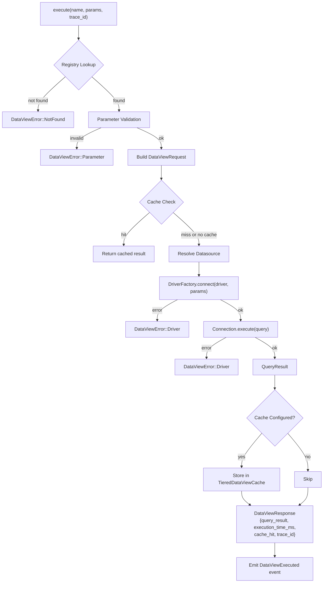
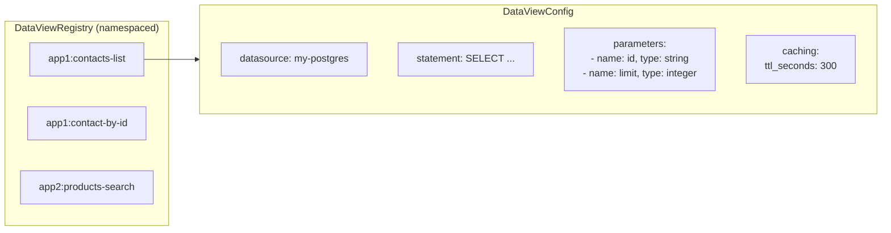
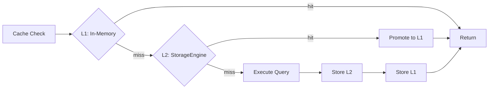

# DataView Engine

## Query Execution Flow

```mermaid
flowchart TD
    REQ["execute(name, params, trace_id)"] --> LOOKUP{Registry Lookup}
    LOOKUP -->|not found| ERR_NF["DataViewError::NotFound"]
    LOOKUP -->|found| VALIDATE[Parameter Validation]
    VALIDATE -->|invalid| ERR_PARAM["DataViewError::Parameter"]
    VALIDATE -->|ok| BUILD[Build DataViewRequest]

    BUILD --> CACHE_CHECK{Cache Check}
    CACHE_CHECK -->|hit| CACHE_RET["Return cached result"]
    CACHE_CHECK -->|miss or no cache| RESOLVE[Resolve Datasource]

    RESOLVE --> CONNECT["DriverFactory.connect(driver, params)"]
    CONNECT -->|error| ERR_CONN["DataViewError::Driver"]
    CONNECT -->|ok| EXEC["Connection.execute(query)"]
    EXEC -->|error| ERR_QUERY["DataViewError::Driver"]
    EXEC -->|ok| RESULT[QueryResult]

    RESULT --> CACHE_STORE{Cache Configured?}
    CACHE_STORE -->|yes| STORE["Store in TieredDataViewCache"]
    CACHE_STORE -->|no| SKIP_CACHE[Skip]
    STORE --> RESPONSE
    SKIP_CACHE --> RESPONSE

    RESPONSE["DataViewResponse\n{query_result, execution_time_ms,\ncache_hit, trace_id}"]
    RESPONSE --> EVENT["Emit DataViewExecuted event"]
```

## DataView Registry

```mermaid
flowchart LR
    subgraph Registry["DataViewRegistry (namespaced)"]
        direction TB
        DV1["app1:contacts-list"]
        DV2["app1:contact-by-id"]
        DV3["app2:products-search"]
    end

    subgraph Config["DataViewConfig"]
        DS["datasource: my-postgres"]
        STMT["statement: SELECT ..."]
        PARAMS["parameters:\n  - name: id, type: string\n  - name: limit, type: integer"]
        CACHING["caching:\n  ttl_seconds: 300"]
    end

    DV1 --> Config
```

## Tiered Cache

```mermaid
flowchart LR
    CHECK["Cache Check"] --> L1{L1: In-Memory}
    L1 -->|hit| RET["Return"]
    L1 -->|miss| L2{L2: StorageEngine}
    L2 -->|hit| PROMOTE["Promote to L1"] --> RET
    L2 -->|miss| ORIGIN["Execute Query"]
    ORIGIN --> STORE_L2["Store L2"] --> STORE_L1["Store L1"] --> RET
```
