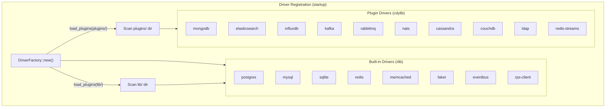
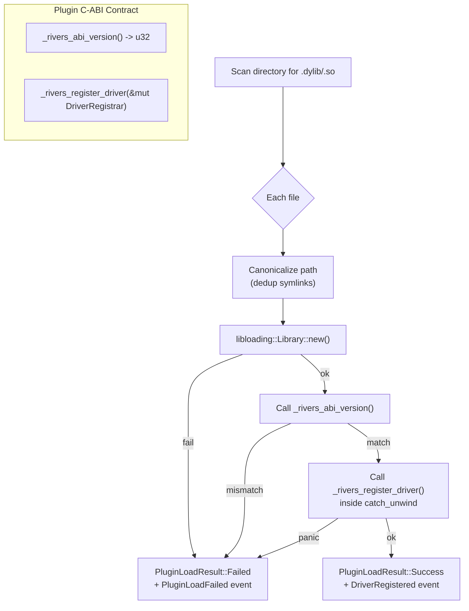
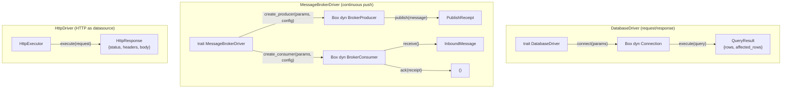
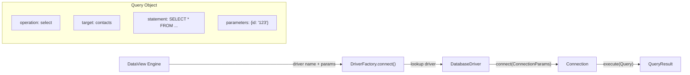

# Driver Layer

## Driver Factory and Registration

```mermaid
flowchart TD
    subgraph Registration["Driver Registration (startup)"]
        FACTORY["DriverFactory::new()"]

        subgraph Builtin["Built-in Drivers (rlib)"]
            POSTGRES["postgres"]
            MYSQL["mysql"]
            SQLITE["sqlite"]
            REDIS["redis"]
            MEMCACHED["memcached"]
            FAKER["faker"]
            EVENTBUS["eventbus"]
            RPS["rps-client"]
        end

        subgraph Plugins["Plugin Drivers (cdylib)"]
            MONGO["mongodb"]
            ES["elasticsearch"]
            INFLUX["influxdb"]
            KAFKA["kafka"]
            RABBIT["rabbitmq"]
            NATS["nats"]
            CASS["cassandra"]
            COUCH["couchdb"]
            LDAP["ldap"]
            RSTREAM["redis-streams"]
        end

        FACTORY --> Builtin
        FACTORY -->|"load_plugins(lib/)"| LIB_SCAN["Scan lib/ dir"]
        FACTORY -->|"load_plugins(plugins/)"| PLUGIN_SCAN["Scan plugins/ dir"]
        LIB_SCAN --> Builtin
        PLUGIN_SCAN --> Plugins
    end
```

## Plugin Loading (cdylib ABI)

```mermaid
flowchart TD
    SCAN["Scan directory for .dylib/.so"] --> EACH{Each file}
    EACH --> CANONICAL["Canonicalize path\n(dedup symlinks)"]
    CANONICAL --> LOAD["libloading::Library::new()"]
    LOAD -->|fail| FAIL_LOG["PluginLoadResult::Failed\n+ PluginLoadFailed event"]
    LOAD -->|ok| ABI_CHECK["Call _rivers_abi_version()"]
    ABI_CHECK -->|mismatch| FAIL_LOG
    ABI_CHECK -->|match| REGISTER["Call _rivers_register_driver()\ninside catch_unwind"]
    REGISTER -->|panic| FAIL_LOG
    REGISTER -->|ok| SUCCESS["PluginLoadResult::Success\n+ DriverRegistered event"]

    subgraph ABI["Plugin C-ABI Contract"]
        direction LR
        SYM1["_rivers_abi_version() -> u32"]
        SYM2["_rivers_register_driver(&mut DriverRegistrar)"]
    end
```

## Driver Trait Hierarchy

```mermaid
flowchart TD
    subgraph Database["DatabaseDriver (request/response)"]
        DD_TRAIT["trait DatabaseDriver"]
        DD_TRAIT -->|"connect(params)"| CONN["Box dyn Connection"]
        CONN -->|"execute(query)"| QR["QueryResult\n{rows, affected_rows}"]
    end

    subgraph Broker["MessageBrokerDriver (continuous push)"]
        BD_TRAIT["trait MessageBrokerDriver"]
        BD_TRAIT -->|"create_producer(params, config)"| PROD["Box dyn BrokerProducer"]
        BD_TRAIT -->|"create_consumer(params, config)"| CONS["Box dyn BrokerConsumer"]
        PROD -->|"publish(message)"| PR["PublishReceipt"]
        CONS -->|"receive()"| IM["InboundMessage"]
        CONS -->|"ack(receipt)"| ACK["()"]
    end

    subgraph HTTP["HttpDriver (HTTP as datasource)"]
        HD_TRAIT["HttpExecutor"]
        HD_TRAIT -->|"execute(request)"| HR["HttpResponse\n{status, headers, body}"]
    end
```

## Query Flow

```mermaid
flowchart LR
    DV["DataView Engine"] -->|"driver name + params"| FF["DriverFactory.connect()"]
    FF -->|"lookup driver"| DRIVER["DatabaseDriver"]
    DRIVER -->|"connect(ConnectionParams)"| CONN["Connection"]
    CONN -->|"execute(Query)"| RESULT["QueryResult"]

    subgraph Query["Query Object"]
        OP["operation: select"]
        TGT["target: contacts"]
        STMT["statement: SELECT * FROM ..."]
        PARAMS["parameters: {id: '123'}"]
    end
```
