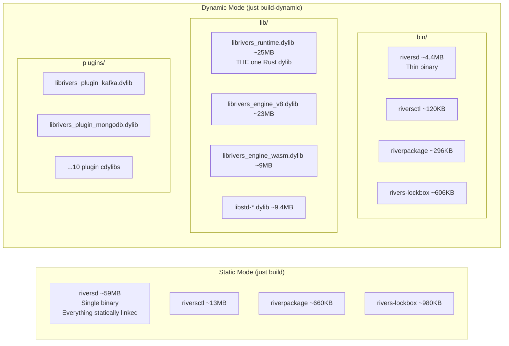
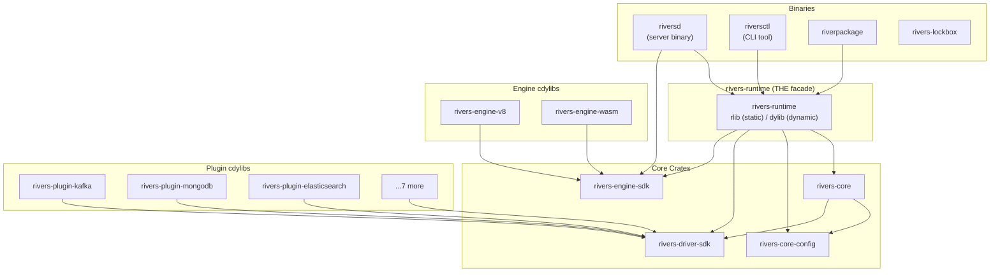
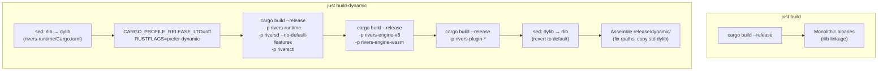
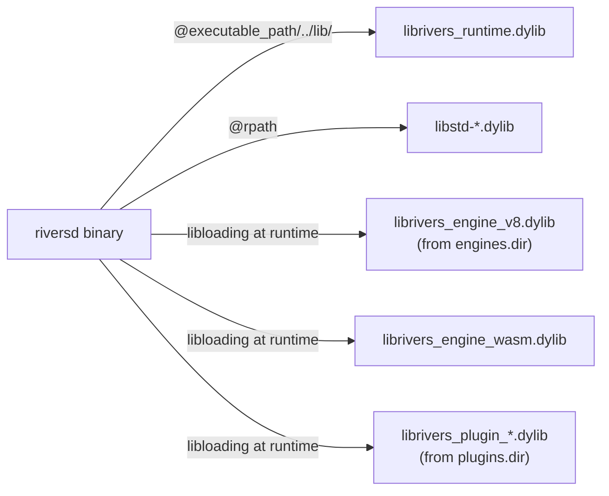

# Dual Build Architecture

## Static vs Dynamic Mode

```mermaid
flowchart LR
    subgraph Static["Static Mode (just build)"]
        direction TB
        S_RIVERSD["riversd ~59MB\nSingle binary\nEverything statically linked"]
        S_CTL["riversctl ~13MB"]
        S_PKG["riverpackage ~660KB"]
        S_LB["rivers-lockbox ~980KB"]
    end

    subgraph Dynamic["Dynamic Mode (just build-dynamic)"]
        direction TB
        subgraph Bin["bin/"]
            D_RIVERSD["riversd ~4.4MB\nThin binary"]
            D_CTL["riversctl ~120KB"]
            D_PKG["riverpackage ~296KB"]
            D_LB["rivers-lockbox ~606KB"]
        end
        subgraph Lib["lib/"]
            D_RT["librivers_runtime.dylib ~25MB\nTHE one Rust dylib"]
            D_V8["librivers_engine_v8.dylib ~23MB"]
            D_WASM["librivers_engine_wasm.dylib ~9MB"]
            D_STD["libstd-*.dylib ~9.4MB"]
        end
        subgraph Plugins["plugins/"]
            D_P1["librivers_plugin_kafka.dylib"]
            D_P2["librivers_plugin_mongodb.dylib"]
            D_P3["...10 plugin cdylibs"]
        end
    end
```

## Crate Dependency Graph

```mermaid
flowchart TD
    subgraph Binaries
        RIVERSD["riversd\n(server binary)"]
        RIVERSCTL["riversctl\n(CLI tool)"]
        RPKG["riverpackage"]
        RLB["rivers-lockbox"]
    end

    subgraph Runtime["rivers-runtime (THE facade)"]
        RT["rivers-runtime\nrlib (static) / dylib (dynamic)"]
    end

    subgraph Core["Core Crates"]
        CORE["rivers-core"]
        CONFIG["rivers-core-config"]
        DSDK["rivers-driver-sdk"]
        ESDK["rivers-engine-sdk"]
    end

    subgraph Engines["Engine cdylibs"]
        EV8["rivers-engine-v8"]
        EWASM["rivers-engine-wasm"]
    end

    subgraph Plugins_c["Plugin cdylibs"]
        PK["rivers-plugin-kafka"]
        PM["rivers-plugin-mongodb"]
        PE["rivers-plugin-elasticsearch"]
        PP["...7 more"]
    end

    RIVERSD --> RT
    RIVERSD --> ESDK
    RIVERSCTL --> RT
    RPKG --> RT

    RT --> CORE
    RT --> CONFIG
    RT --> DSDK
    RT --> ESDK

    CORE --> CONFIG
    CORE --> DSDK

    EV8 --> ESDK
    EWASM --> ESDK

    PK --> DSDK
    PM --> DSDK
    PE --> DSDK
    PP --> DSDK
```

## Build Flow (Justfile)

```mermaid
flowchart TD
    subgraph StaticBuild["just build"]
        SB1["cargo build --release"] --> SB2["Monolithic binaries\n(rlib linkage)"]
    end

    subgraph DynamicBuild["just build-dynamic"]
        DB1["sed: rlib → dylib\n(rivers-runtime/Cargo.toml)"]
        DB1 --> DB2["CARGO_PROFILE_RELEASE_LTO=off\nRUSTFLAGS=prefer-dynamic"]
        DB2 --> DB3["cargo build --release\n-p rivers-runtime\n-p riversd --no-default-features\n-p riversctl"]
        DB3 --> DB4["cargo build --release\n-p rivers-engine-v8\n-p rivers-engine-wasm"]
        DB4 --> DB5["cargo build --release\n-p rivers-plugin-*"]
        DB5 --> DB6["sed: dylib → rlib\n(revert to default)"]
        DB6 --> DB7["Assemble release/dynamic/\n(fix rpaths, copy std dylib)"]
    end
```

## Dynamic Linking (macOS)

```mermaid
flowchart LR
    RIVERSD["riversd binary"] -->|"@executable_path/../lib/"| RT_DYLIB["librivers_runtime.dylib"]
    RIVERSD -->|"@rpath"| STD_DYLIB["libstd-*.dylib"]

    RIVERSD -->|"libloading at runtime"| EV8["librivers_engine_v8.dylib\n(from engines.dir)"]
    RIVERSD -->|"libloading at runtime"| EWASM["librivers_engine_wasm.dylib"]
    RIVERSD -->|"libloading at runtime"| PLUGINS["librivers_plugin_*.dylib\n(from plugins.dir)"]
```
