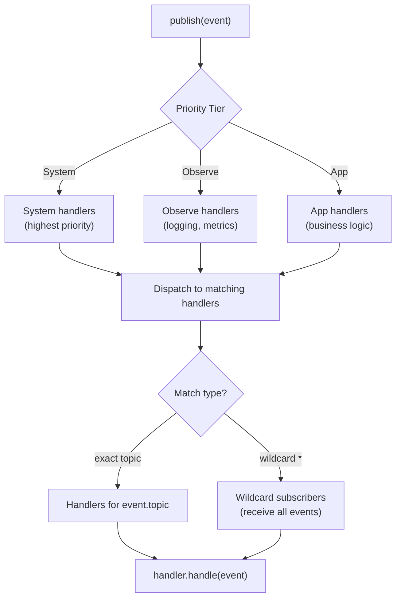
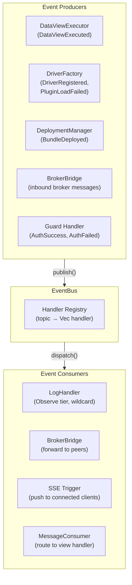
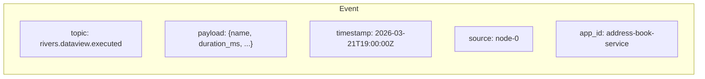

# EventBus

## Publish/Subscribe Flow

```mermaid
flowchart TD
    PUB["publish(event)"] --> TIER{Priority Tier}
    TIER -->|System| SYS_Q["System handlers\n(highest priority)"]
    TIER -->|Observe| OBS_Q["Observe handlers\n(logging, metrics)"]
    TIER -->|App| APP_Q["App handlers\n(business logic)"]

    SYS_Q --> DISPATCH
    OBS_Q --> DISPATCH
    APP_Q --> DISPATCH

    DISPATCH["Dispatch to matching handlers"] --> MATCH{Match type?}
    MATCH -->|exact topic| EXACT["Handlers for event.topic"]
    MATCH -->|wildcard *| WILD["Wildcard subscribers\n(receive all events)"]

    EXACT --> HANDLER["handler.handle(event)"]
    WILD --> HANDLER
```

## Handler Registration

```mermaid
flowchart TD
    subgraph Producers["Event Producers"]
        P_DV["DataViewExecutor\n(DataViewExecuted)"]
        P_DRIVER["DriverFactory\n(DriverRegistered,\nPluginLoadFailed)"]
        P_DEPLOY["DeploymentManager\n(BundleDeployed)"]
        P_BROKER["BrokerBridge\n(inbound broker messages)"]
        P_GUARD["Guard Handler\n(AuthSuccess, AuthFailed)"]
    end

    subgraph Bus["EventBus"]
        REG["Handler Registry\n(topic → Vec handler)"]
    end

    subgraph Consumers["Event Consumers"]
        C_LOG["LogHandler\n(Observe tier, wildcard)"]
        C_BRIDGE["BrokerBridge\n(forward to peers)"]
        C_SSE["SSE Trigger\n(push to connected clients)"]
        C_MSG["MessageConsumer\n(route to view handler)"]
    end

    Producers -->|"publish()"| Bus
    Bus -->|"dispatch()"| Consumers
```

## Event Structure

```mermaid
flowchart LR
    subgraph Event["Event"]
        TOPIC["topic: rivers.dataview.executed"]
        PAYLOAD["payload: {name, duration_ms, ...}"]
        TS["timestamp: 2026-03-21T19:00:00Z"]
        SRC["source: node-0"]
        APP["app_id: address-book-service"]
    end
```
