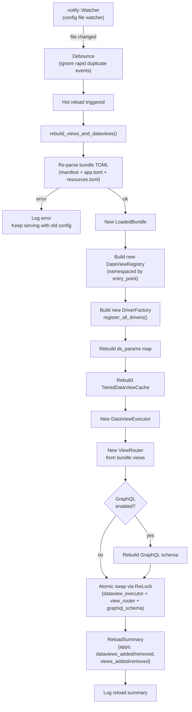
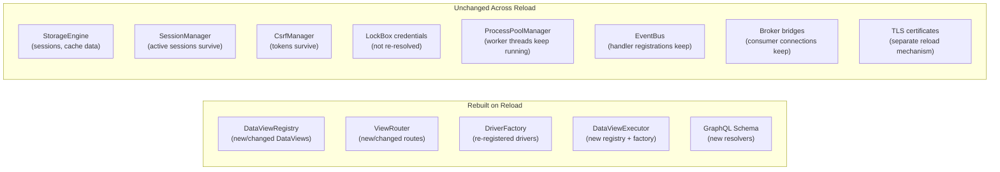
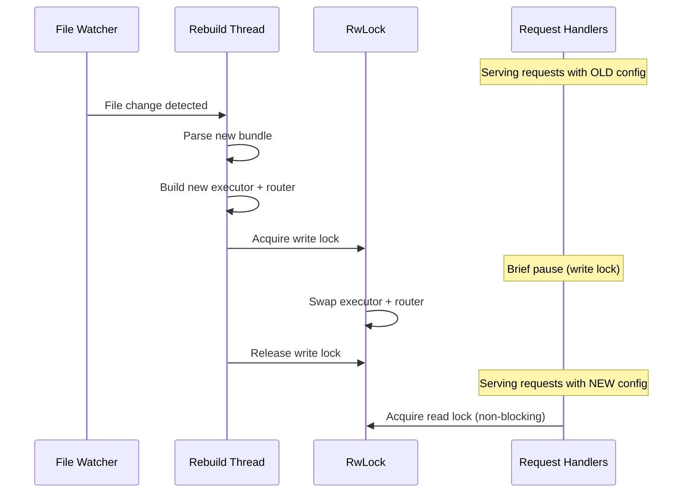

# Hot Reload

## File Watch + Rebuild Flow

```mermaid
flowchart TD
    WATCHER["notify::Watcher\n(config file watcher)"] -->|"file changed"| DEBOUNCE["Debounce\n(ignore rapid duplicate events)"]
    DEBOUNCE --> TRIGGER["Hot reload triggered"]
    TRIGGER --> REBUILD["rebuild_views_and_dataviews()"]

    REBUILD --> PARSE["Re-parse bundle TOML\n(manifest + app.toml + resources.toml)"]
    PARSE -->|error| LOG_ERR["Log error\nKeep serving with old config"]
    PARSE -->|ok| NEW_BUNDLE["New LoadedBundle"]

    NEW_BUNDLE --> NEW_REG["Build new DataViewRegistry\n(namespaced by entry_point)"]
    NEW_REG --> NEW_FACTORY["Build new DriverFactory\nregister_all_drivers()"]
    NEW_FACTORY --> NEW_PARAMS["Rebuild ds_params map"]
    NEW_PARAMS --> NEW_CACHE["Rebuild TieredDataViewCache"]
    NEW_CACHE --> NEW_EXEC["New DataViewExecutor"]
    NEW_EXEC --> NEW_ROUTER["New ViewRouter\nfrom bundle views"]

    NEW_ROUTER --> GQL{GraphQL\nenabled?}
    GQL -->|yes| NEW_SCHEMA["Rebuild GraphQL schema"]
    GQL -->|no| SWAP

    NEW_SCHEMA --> SWAP["Atomic swap via RwLock\n(dataview_executor + view_router + graphql_schema)"]
    SWAP --> SUMMARY["ReloadSummary\n{apps, dataviews_added/removed,\nviews_added/removed}"]
    SUMMARY --> LOG["Log reload summary"]
```

## What Changes vs What Persists

```mermaid
flowchart LR
    subgraph Rebuilt["Rebuilt on Reload"]
        R1["DataViewRegistry\n(new/changed DataViews)"]
        R2["ViewRouter\n(new/changed routes)"]
        R3["DriverFactory\n(re-registered drivers)"]
        R4["DataViewExecutor\n(new registry + factory)"]
        R5["GraphQL Schema\n(new resolvers)"]
    end

    subgraph Persists["Unchanged Across Reload"]
        P1["StorageEngine\n(sessions, cache data)"]
        P2["SessionManager\n(active sessions survive)"]
        P3["CsrfManager\n(tokens survive)"]
        P4["LockBox credentials\n(not re-resolved)"]
        P5["ProcessPoolManager\n(worker threads keep running)"]
        P6["EventBus\n(handler registrations keep)"]
        P7["Broker bridges\n(consumer connections keep)"]
        P8["TLS certificates\n(separate reload mechanism)"]
    end
```

## Zero-Downtime Swap

```mermaid
sequenceDiagram
    participant W as File Watcher
    participant R as Rebuild Thread
    participant RW as RwLock
    participant H as Request Handlers

    Note over H: Serving requests with OLD config
    W->>R: File change detected
    R->>R: Parse new bundle
    R->>R: Build new executor + router
    R->>RW: Acquire write lock
    Note over H: Brief pause (write lock)
    RW->>RW: Swap executor + router
    R->>RW: Release write lock
    Note over H: Serving requests with NEW config
    H->>RW: Acquire read lock (non-blocking)
```
