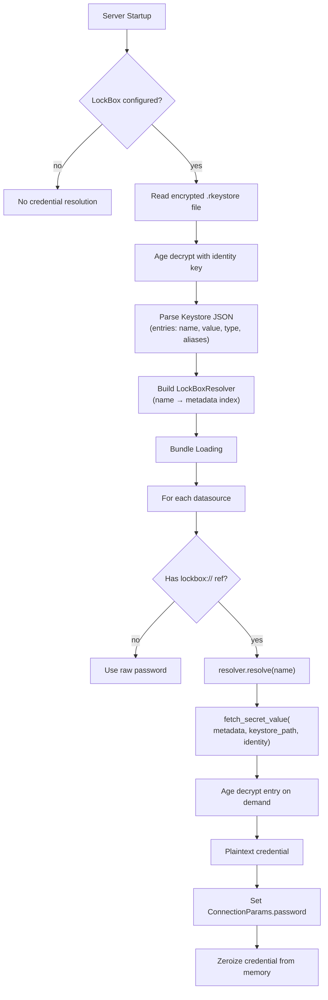
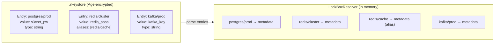
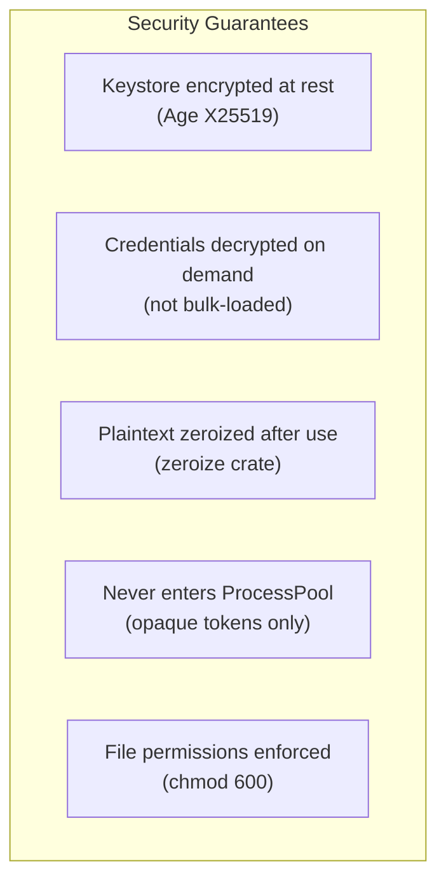

# LockBox

## Credential Resolution Flow

```mermaid
flowchart TD
    STARTUP["Server Startup"] --> LOAD_CFG{LockBox configured?}
    LOAD_CFG -->|no| SKIP["No credential resolution"]
    LOAD_CFG -->|yes| READ_KS["Read encrypted .rkeystore file"]
    READ_KS --> DECRYPT["Age decrypt with identity key"]
    DECRYPT --> PARSE["Parse Keystore JSON\n(entries: name, value, type, aliases)"]
    PARSE --> RESOLVER["Build LockBoxResolver\n(name → metadata index)"]

    RESOLVER --> BUNDLE["Bundle Loading"]
    BUNDLE --> DS_LOOP["For each datasource"]
    DS_LOOP --> CRED_REF{Has lockbox:// ref?}
    CRED_REF -->|no| RAW["Use raw password"]
    CRED_REF -->|yes| RESOLVE["resolver.resolve(name)"]
    RESOLVE --> FETCH["fetch_secret_value(\nmetadata, keystore_path, identity)"]
    FETCH --> DECRYPT2["Age decrypt entry on demand"]
    DECRYPT2 --> VALUE["Plaintext credential"]
    VALUE --> CONN_PARAMS["Set ConnectionParams.password"]
    CONN_PARAMS --> ZEROIZE["Zeroize credential from memory"]
```

## Keystore Structure

```mermaid
flowchart LR
    subgraph Keystore[".rkeystore (Age-encrypted)"]
        direction TB
        E1["Entry: postgres/prod\nvalue: s3cret_pw\ntype: string"]
        E2["Entry: redis/cluster\nvalue: redis_pass\naliases: [redis/cache]"]
        E3["Entry: kafka/prod\nvalue: kafka_key\ntype: string"]
    end

    subgraph Resolver["LockBoxResolver (in memory)"]
        direction TB
        M1["postgres/prod → metadata"]
        M2["redis/cluster → metadata"]
        M3["redis/cache → metadata (alias)"]
        M4["kafka/prod → metadata"]
    end

    Keystore -->|"parse entries"| Resolver
```

## Security Properties

```mermaid
flowchart TD
    subgraph Guarantees["Security Guarantees"]
        G1["Keystore encrypted at rest\n(Age X25519)"]
        G2["Credentials decrypted on demand\n(not bulk-loaded)"]
        G3["Plaintext zeroized after use\n(zeroize crate)"]
        G4["Never enters ProcessPool\n(opaque tokens only)"]
        G5["File permissions enforced\n(chmod 600)"]
    end
```
