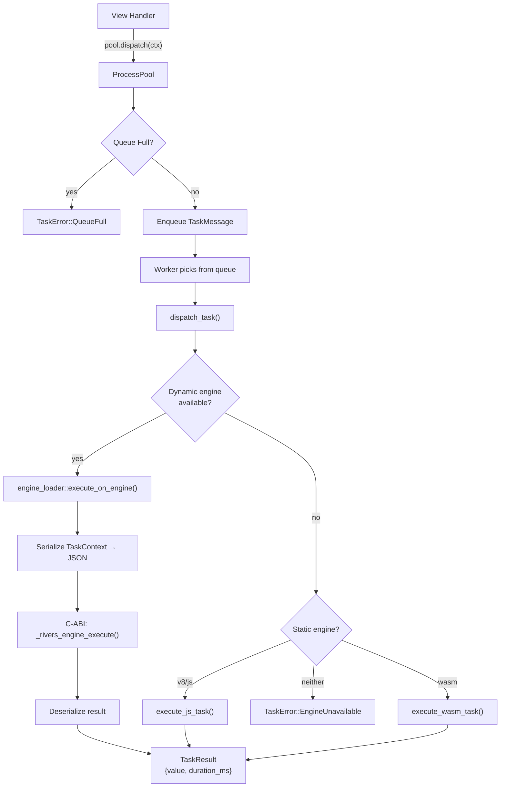
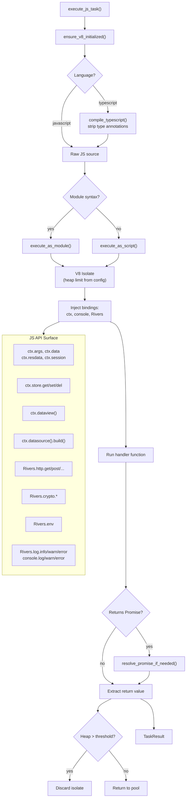
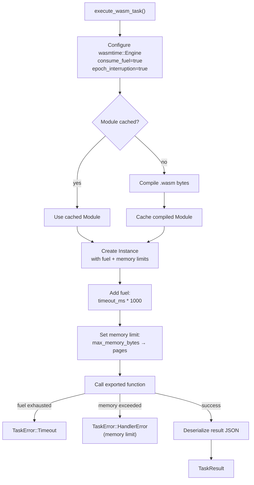
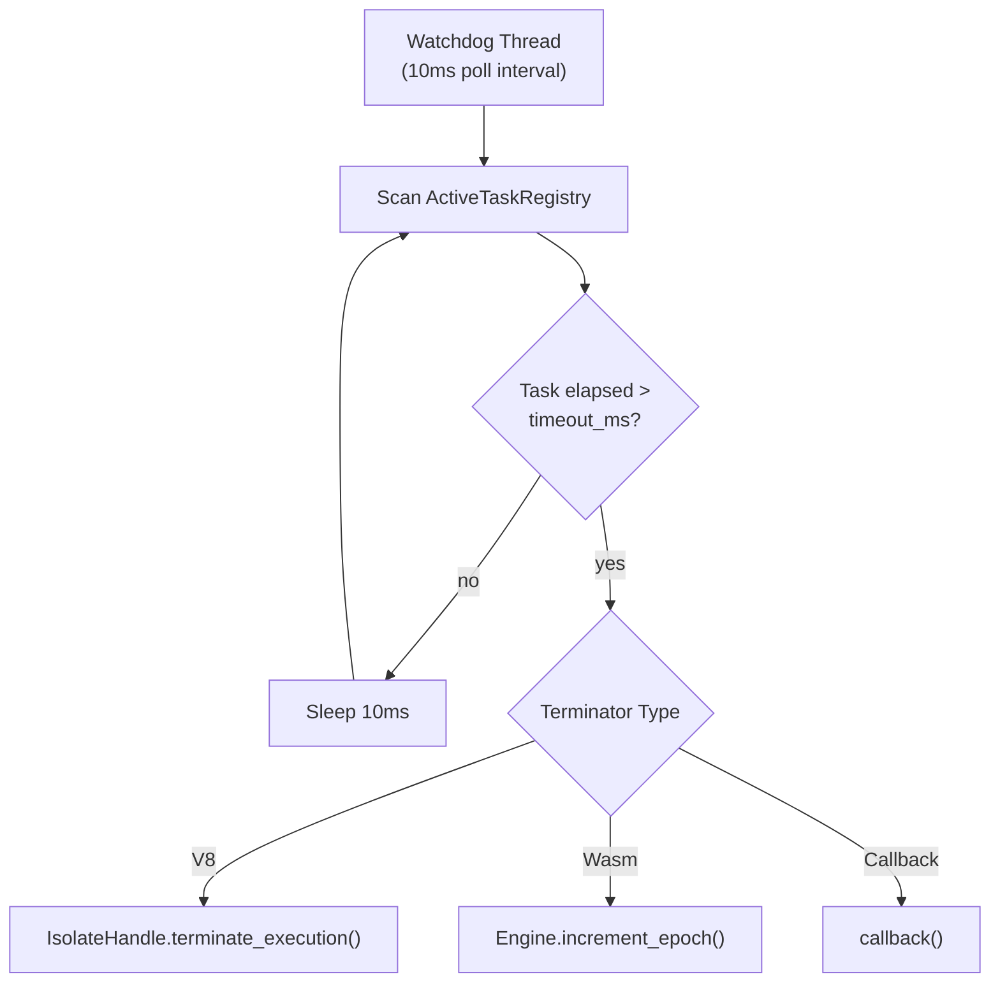
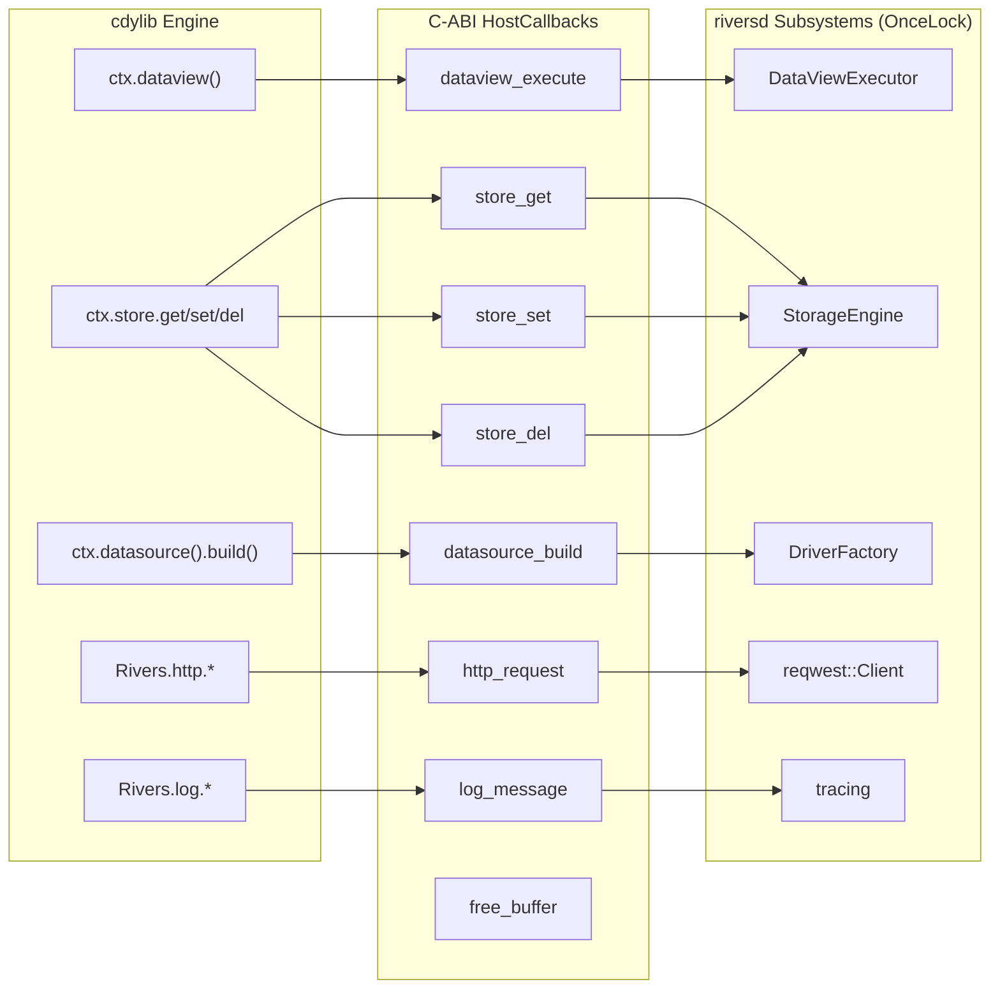

# ProcessPool + Engine Runtime

## Task Dispatch Flow

```mermaid
flowchart TD
    VIEW["View Handler"] -->|"pool.dispatch(ctx)"| POOL["ProcessPool"]
    POOL --> QUEUE_CHECK{Queue Full?}
    QUEUE_CHECK -->|yes| QF_ERR["TaskError::QueueFull"]
    QUEUE_CHECK -->|no| ENQUEUE["Enqueue TaskMessage"]
    ENQUEUE --> WORKER["Worker picks from queue"]
    WORKER --> DISPATCH["dispatch_task()"]

    DISPATCH --> DYN_CHECK{Dynamic engine\navailable?}
    DYN_CHECK -->|yes| DYN_PATH["engine_loader::execute_on_engine()"]
    DYN_CHECK -->|no| STATIC{Static engine?}
    STATIC -->|v8/js| V8_EXEC["execute_js_task()"]
    STATIC -->|wasm| WASM_EXEC["execute_wasm_task()"]
    STATIC -->|neither| UNAVAIL["TaskError::EngineUnavailable"]

    DYN_PATH --> SERIALIZE["Serialize TaskContext → JSON"]
    SERIALIZE --> CABI["C-ABI: _rivers_engine_execute()"]
    CABI --> DESER["Deserialize result"]
    DESER --> RESULT

    V8_EXEC --> RESULT["TaskResult\n{value, duration_ms}"]
    WASM_EXEC --> RESULT
```

## V8 JavaScript Engine

```mermaid
flowchart TD
    TASK["execute_js_task()"] --> INIT["ensure_v8_initialized()"]
    INIT --> LANG{Language?}
    LANG -->|typescript| TS["compile_typescript()\nstrip type annotations"]
    LANG -->|javascript| JS_SRC["Raw JS source"]
    TS --> JS_SRC

    JS_SRC --> MODULE{Module syntax?}
    MODULE -->|yes| MOD_EXEC["execute_as_module()"]
    MODULE -->|no| SCRIPT_EXEC["execute_as_script()"]

    MOD_EXEC --> ISOLATE["V8 Isolate\n(heap limit from config)"]
    SCRIPT_EXEC --> ISOLATE

    ISOLATE --> BINDINGS["Inject bindings:\nctx, console, Rivers"]

    subgraph Bindings["JS API Surface"]
        B_CTX["ctx.args, ctx.data\nctx.resdata, ctx.session"]
        B_STORE["ctx.store.get/set/del"]
        B_DV["ctx.dataview()"]
        B_DS["ctx.datasource().build()"]
        B_HTTP["Rivers.http.get/post/..."]
        B_CRYPTO["Rivers.crypto.*"]
        B_ENV["Rivers.env"]
        B_LOG["Rivers.log.info/warn/error\nconsole.log/warn/error"]
    end

    BINDINGS --> Bindings
    BINDINGS --> EXECUTE["Run handler function"]
    EXECUTE --> PROMISE{Returns Promise?}
    PROMISE -->|yes| RESOLVE["resolve_promise_if_needed()"]
    PROMISE -->|no| EXTRACT["Extract return value"]
    RESOLVE --> EXTRACT

    EXTRACT --> HEAP_CHECK{Heap > threshold?}
    HEAP_CHECK -->|yes| DISCARD["Discard isolate"]
    HEAP_CHECK -->|no| RECYCLE["Return to pool"]

    EXTRACT --> RESULT["TaskResult"]
```

## WASM Engine

```mermaid
flowchart TD
    TASK["execute_wasm_task()"] --> CONFIG["Configure wasmtime::Engine\nconsume_fuel=true\nepoch_interruption=true"]
    CONFIG --> CACHE_CHECK{Module cached?}
    CACHE_CHECK -->|yes| CACHED["Use cached Module"]
    CACHE_CHECK -->|no| COMPILE["Compile .wasm bytes"]
    COMPILE --> CACHE_STORE["Cache compiled Module"]

    CACHED --> INSTANCE["Create Instance\nwith fuel + memory limits"]
    CACHE_STORE --> INSTANCE

    INSTANCE --> FUEL["Add fuel:\ntimeout_ms * 1000"]
    FUEL --> MEM["Set memory limit:\nmax_memory_bytes → pages"]
    MEM --> CALL["Call exported function"]

    CALL -->|fuel exhausted| TIMEOUT["TaskError::Timeout"]
    CALL -->|memory exceeded| OOM["TaskError::HandlerError\n(memory limit)"]
    CALL -->|success| DESER["Deserialize result JSON"]
    DESER --> RESULT["TaskResult"]
```

## Watchdog (Per-Pool Timeout Enforcement)

```mermaid
flowchart TD
    THREAD["Watchdog Thread\n(10ms poll interval)"] --> SCAN["Scan ActiveTaskRegistry"]
    SCAN --> CHECK{Task elapsed >\ntimeout_ms?}
    CHECK -->|no| SLEEP["Sleep 10ms"]
    SLEEP --> SCAN
    CHECK -->|yes| TERM{Terminator Type}
    TERM -->|V8| V8_KILL["IsolateHandle.terminate_execution()"]
    TERM -->|Wasm| EPOCH["Engine.increment_epoch()"]
    TERM -->|Callback| CB["callback()"]
```

## Host Callbacks (cdylib → riversd bridge)

```mermaid
flowchart LR
    subgraph Engine["cdylib Engine"]
        E_DV["ctx.dataview()"]
        E_STORE["ctx.store.get/set/del"]
        E_DS["ctx.datasource().build()"]
        E_HTTP["Rivers.http.*"]
        E_LOG["Rivers.log.*"]
    end

    subgraph ABI["C-ABI HostCallbacks"]
        CB_DV["dataview_execute"]
        CB_SG["store_get"]
        CB_SS["store_set"]
        CB_SD["store_del"]
        CB_DS["datasource_build"]
        CB_HTTP["http_request"]
        CB_LOG["log_message"]
        CB_FREE["free_buffer"]
    end

    subgraph Host["riversd Subsystems (OnceLock)"]
        H_DV["DataViewExecutor"]
        H_SE["StorageEngine"]
        H_DF["DriverFactory"]
        H_HC["reqwest::Client"]
        H_TR["tracing"]
    end

    E_DV --> CB_DV --> H_DV
    E_STORE --> CB_SG --> H_SE
    E_STORE --> CB_SS --> H_SE
    E_STORE --> CB_SD --> H_SE
    E_DS --> CB_DS --> H_DF
    E_HTTP --> CB_HTTP --> H_HC
    E_LOG --> CB_LOG --> H_TR
```
