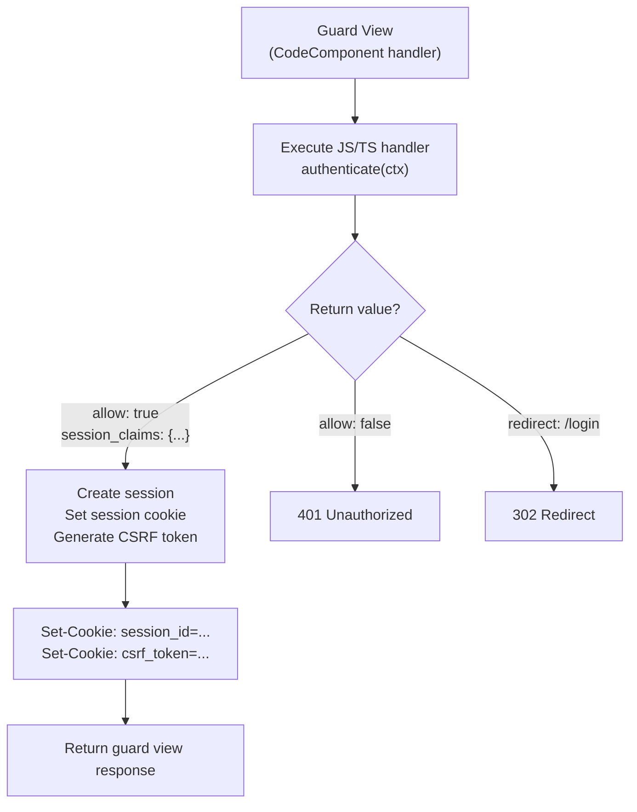
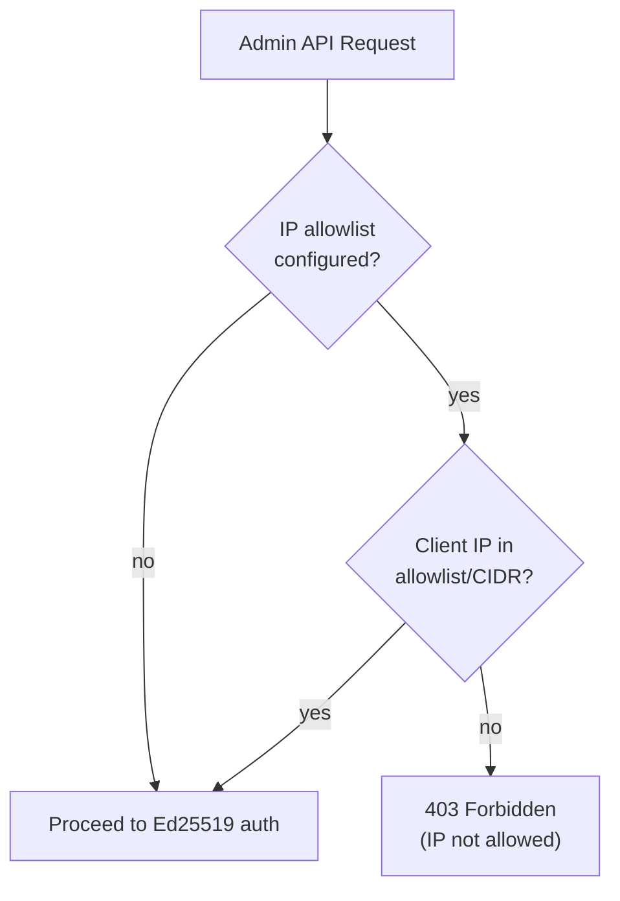

# Security Pipeline

## Request Security Flow

```mermaid
flowchart TD
    REQ["Incoming Request"] --> CORS{CORS enabled?}
    CORS -->|yes + preflight| CORS_RESP["200 with CORS headers"]
    CORS -->|yes + origin blocked| CORS_DENY["403 CORS Denied"]
    CORS -->|pass| RATE{Rate limit\nconfigured?}

    RATE -->|over limit| RATE_DENY["429 Too Many Requests\n+ Retry-After header"]
    RATE -->|ok| SEC_PIPE["Security Pipeline"]

    SEC_PIPE --> STEP1["Step 1: Extract Session ID\n(cookie or Authorization header)"]
    STEP1 --> PUBLIC{Public view?}
    PUBLIC -->|yes| PASS["Skip auth → execute view"]

    PUBLIC -->|no| STEP2["Step 2: Session Validation"]
    STEP2 --> SID{Session ID\npresent?}
    SID -->|yes| VALIDATE["SessionManager.validate_session()"]
    SID -->|no| NO_SESSION["No session"]

    VALIDATE -->|valid| SESSION_OK["Session loaded\n(claims available)"]
    VALIDATE -->|invalid/expired| CLEAR["Mark: clear session cookie"]
    CLEAR --> NO_SESSION

    NO_SESSION --> GUARD{Guard view\nconfigured?}
    GUARD -->|yes + redirect URL| REDIRECT["302 Redirect to guard view"]
    GUARD -->|yes + no redirect| REJECT["401 Unauthorized"]
    GUARD -->|no| REJECT

    SESSION_OK --> STEP3["Step 3: CSRF Check"]
    STEP3 --> CSRF_NEED{Mutating method?\n(POST/PUT/DELETE/PATCH)}
    CSRF_NEED -->|no| EXECUTE["Execute view handler"]
    CSRF_NEED -->|yes| CSRF_CHECK["Validate CSRF token\n(double-submit cookie)"]
    CSRF_CHECK -->|valid| EXECUTE
    CSRF_CHECK -->|invalid| CSRF_DENY["403 CSRF Validation Failed"]
```

## Guard View (Authentication CodeComponent)



## IP Allowlist (Admin API)



