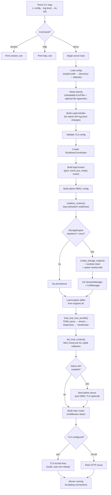
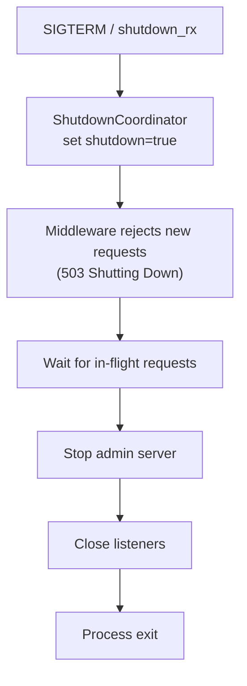

# Server Startup Sequence

## Full Boot Flow

```mermaid
flowchart TD
    CLI["Parse CLI args\n(--config, --log-level, --no-ssl)"] --> CMD{Command?}
    CMD -->|version| PRINT_VER["Print version, exit"]
    CMD -->|help| PRINT_HELP["Print help, exit"]
    CMD -->|serve| BOOT["Begin server boot"]

    BOOT --> CONFIG["Load config\n(explicit path → discovery → defaults)"]
    CONFIG --> LOG["Setup tracing\n(reloadable EnvFilter + optional file appender)"]
    LOG --> LOG_CTRL["Build LogController\n(for admin API log-level changes)"]

    LOG_CTRL --> TLS_VAL["Validate TLS config"]
    TLS_VAL --> SHUTDOWN["Create ShutdownCoordinator"]
    SHUTDOWN --> APP_CTX["Build AppContext\n(pool, event_bus, empty router)"]

    APP_CTX --> ADMIN_AUTH["Build admin RBAC config"]
    ADMIN_AUTH --> RUNTIME["initialize_runtime()\n(log subsystem readiness)"]

    RUNTIME --> STORAGE{StorageEngine\nbackend != none?}
    STORAGE -->|yes| STORAGE_INIT["create_storage_engine()\n+ sentinel claim\n+ spawn sweep task"]
    STORAGE -->|no| SKIP_STORAGE["No persistence"]
    STORAGE_INIT --> SESSION["Init SessionManager\n+ CsrfManager"]
    SKIP_STORAGE --> ENGINE_LOAD

    SESSION --> ENGINE_LOAD["Load engine dylibs\nfrom engines.dir"]
    ENGINE_LOAD --> BUNDLE["load_and_wire_bundle()\nTOML parse → drivers → DataViews → ViewRouter"]

    BUNDLE --> HOST_CTX["set_host_context()\nWire OnceLock for cdylib callbacks"]

    HOST_CTX --> ADMIN{Admin API\nenabled?}
    ADMIN -->|yes| ADMIN_BIND["Bind admin server\n(port 9090, TLS optional)"]
    ADMIN -->|no| MAIN_SERVE

    ADMIN_BIND --> MAIN_SERVE["Build main router\n(middleware stack)"]
    MAIN_SERVE --> TLS_SERVE{TLS configured?}
    TLS_SERVE -->|yes| HTTPS["TLS accept loop\n(rustls, auto cert reload)"]
    TLS_SERVE -->|no-ssl| HTTP["Plain HTTP serve"]

    HTTPS --> RUNNING["Server running\nAccepting connections"]
    HTTP --> RUNNING
```

## Shutdown Sequence

```mermaid
flowchart TD
    SIGNAL["SIGTERM / shutdown_rx"] --> COORD["ShutdownCoordinator\nset shutdown=true"]
    COORD --> DRAIN["Middleware rejects new requests\n(503 Shutting Down)"]
    DRAIN --> WAIT["Wait for in-flight requests"]
    WAIT --> ADMIN_STOP["Stop admin server"]
    ADMIN_STOP --> CLOSE["Close listeners"]
    CLOSE --> EXIT["Process exit"]
```
