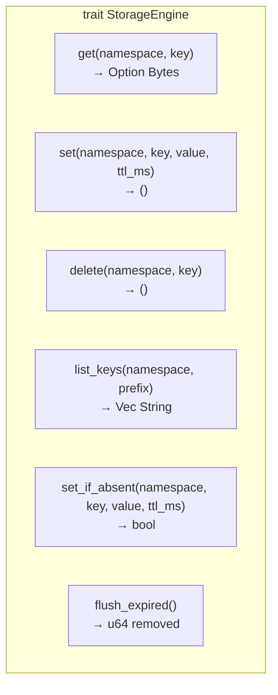
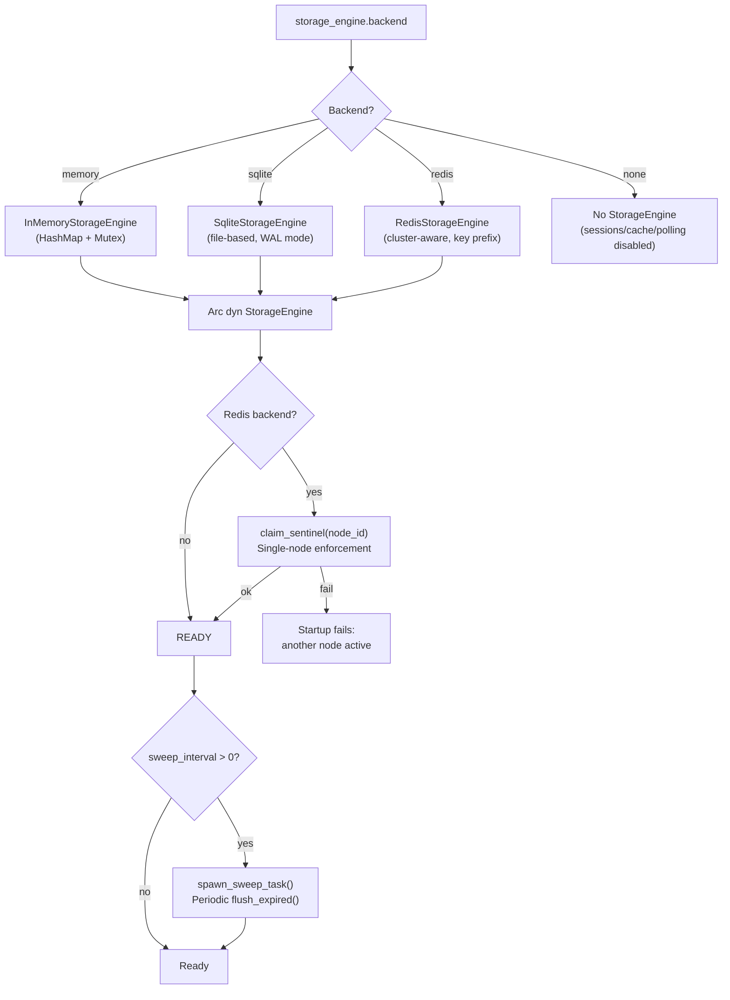
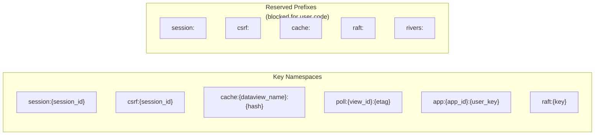
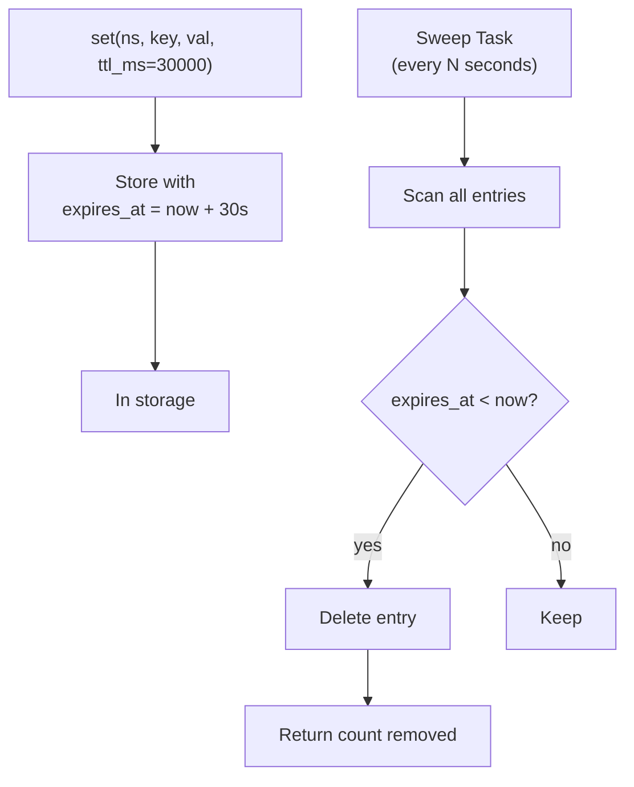

# StorageEngine

## Trait Interface

```mermaid
flowchart TD
    subgraph Trait["trait StorageEngine"]
        GET["get(namespace, key)\n→ Option Bytes"]
        SET["set(namespace, key, value, ttl_ms)\n→ ()"]
        DEL["delete(namespace, key)\n→ ()"]
        LIST["list_keys(namespace, prefix)\n→ Vec String"]
        SETABS["set_if_absent(namespace, key, value, ttl_ms)\n→ bool"]
        FLUSH["flush_expired()\n→ u64 removed"]
    end
```

## Backend Selection

```mermaid
flowchart TD
    CONFIG["storage_engine.backend"] --> MATCH{Backend?}
    MATCH -->|"memory"| MEM["InMemoryStorageEngine\n(HashMap + Mutex)"]
    MATCH -->|"sqlite"| SQL["SqliteStorageEngine\n(file-based, WAL mode)"]
    MATCH -->|"redis"| RED["RedisStorageEngine\n(cluster-aware, key prefix)"]
    MATCH -->|"none"| NONE["No StorageEngine\n(sessions/cache/polling disabled)"]

    MEM --> INIT["Arc dyn StorageEngine"]
    SQL --> INIT
    RED --> INIT

    INIT --> SENTINEL{Redis backend?}
    SENTINEL -->|yes| CLAIM["claim_sentinel(node_id)\nSingle-node enforcement"]
    SENTINEL -->|no| READY

    CLAIM -->|fail| ABORT["Startup fails:\nanother node active"]
    CLAIM -->|ok| READY

    READY --> SWEEP{sweep_interval > 0?}
    SWEEP -->|yes| SPAWN["spawn_sweep_task()\nPeriodic flush_expired()"]
    SWEEP -->|no| DONE["Ready"]
    SPAWN --> DONE
```

## Namespace Isolation

```mermaid
flowchart LR
    subgraph Namespaces["Key Namespaces"]
        direction TB
        NS_SESSION["session:{session_id}"]
        NS_CSRF["csrf:{session_id}"]
        NS_CACHE["cache:{dataview_name}:{hash}"]
        NS_POLL["poll:{view_id}:{etag}"]
        NS_APP["app:{app_id}:{user_key}"]
        NS_RAFT["raft:{key}"]
    end

    subgraph Reserved["Reserved Prefixes\n(blocked for user code)"]
        R1["session:"]
        R2["csrf:"]
        R3["cache:"]
        R4["raft:"]
        R5["rivers:"]
    end
```

## TTL Expiration

```mermaid
flowchart TD
    SET_OP["set(ns, key, val, ttl_ms=30000)"] --> STORE["Store with\nexpires_at = now + 30s"]
    STORE --> STORED["In storage"]

    SWEEP["Sweep Task\n(every N seconds)"] --> SCAN["Scan all entries"]
    SCAN --> CHECK{expires_at < now?}
    CHECK -->|yes| REMOVE["Delete entry"]
    CHECK -->|no| KEEP["Keep"]
    REMOVE --> COUNT["Return count removed"]
```
