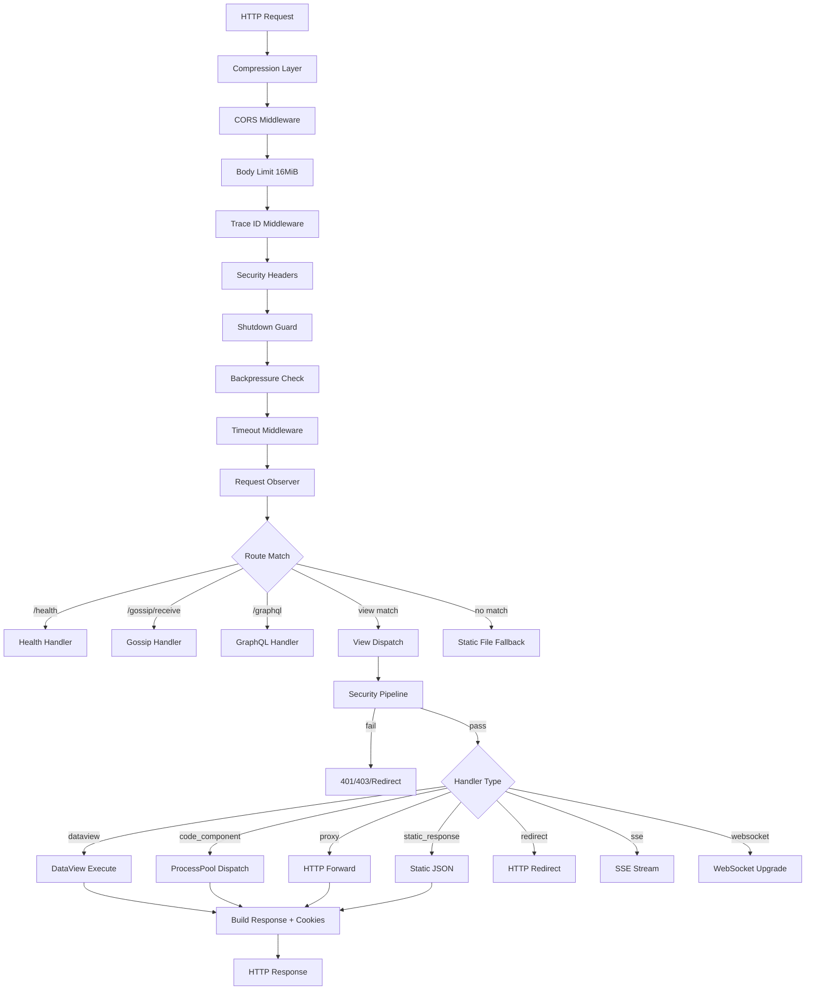
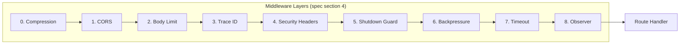
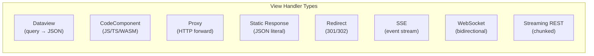

# View Layer

## Request Flow

```mermaid
flowchart TD
    REQ[HTTP Request] --> COMP[Compression Layer]
    COMP --> CORS[CORS Middleware]
    CORS --> BODY[Body Limit 16MiB]
    BODY --> TRACE[Trace ID Middleware]
    TRACE --> SEC_HDR[Security Headers]
    SEC_HDR --> SHUT[Shutdown Guard]
    SHUT --> BP[Backpressure Check]
    BP --> TIMEOUT[Timeout Middleware]
    TIMEOUT --> OBS[Request Observer]
    OBS --> ROUTE{Route Match}

    ROUTE -->|/health| HEALTH[Health Handler]
    ROUTE -->|/gossip/receive| GOSSIP[Gossip Handler]
    ROUTE -->|/graphql| GQL[GraphQL Handler]
    ROUTE -->|view match| VIEW[View Dispatch]
    ROUTE -->|no match| STATIC[Static File Fallback]

    VIEW --> SEC_PIPE[Security Pipeline]
    SEC_PIPE -->|fail| ERR_RESP[401/403/Redirect]
    SEC_PIPE -->|pass| HANDLER{Handler Type}

    HANDLER -->|dataview| DV_EXEC[DataView Execute]
    HANDLER -->|code_component| PP_DISPATCH[ProcessPool Dispatch]
    HANDLER -->|proxy| HTTP_FWD[HTTP Forward]
    HANDLER -->|static_response| STATIC_RESP[Static JSON]
    HANDLER -->|redirect| REDIR[HTTP Redirect]
    HANDLER -->|sse| SSE[SSE Stream]
    HANDLER -->|websocket| WS[WebSocket Upgrade]

    DV_EXEC --> RESP[Build Response + Cookies]
    PP_DISPATCH --> RESP
    HTTP_FWD --> RESP
    STATIC_RESP --> RESP
    RESP --> REQ_OUT[HTTP Response]
```

## Middleware Stack (outermost to innermost)

```mermaid
flowchart LR
    subgraph Middleware["Middleware Layers (spec section 4)"]
        direction LR
        L0["0. Compression"] --> L1["1. CORS"]
        L1 --> L2["2. Body Limit"]
        L2 --> L3["3. Trace ID"]
        L3 --> L4["4. Security Headers"]
        L4 --> L7["5. Shutdown Guard"]
        L7 --> L8["6. Backpressure"]
        L8 --> L9["7. Timeout"]
        L9 --> L10["8. Observer"]
    end
    L10 --> HANDLER["Route Handler"]
```

## View Types

```mermaid
flowchart LR
    subgraph Views["View Handler Types"]
        DV["Dataview\n(query → JSON)"]
        CC["CodeComponent\n(JS/TS/WASM)"]
        PX["Proxy\n(HTTP forward)"]
        SR["Static Response\n(JSON literal)"]
        RD["Redirect\n(301/302)"]
        SSE["SSE\n(event stream)"]
        WS["WebSocket\n(bidirectional)"]
        STR["Streaming REST\n(chunked)"]
    end
```
